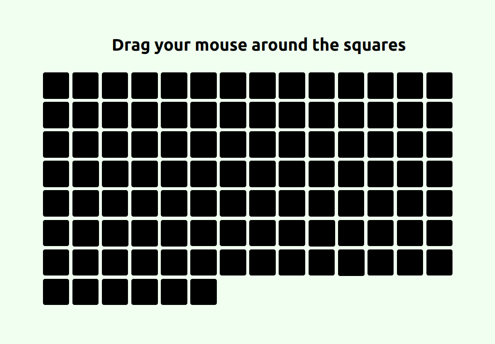

# Lighting Grid

This is a small project built with HTML, CSS, and JavaScript.

## Features

-Interactive animations
-Flexbox



## What I learned

I learned how to add animations when i hover over with a mouse and how to add a random color to each square

```div.addEventListener("mouseenter", () => {
    const randomColor = `hsl(${Math.floor(Math.random() * 360)}, 80%, 60%)`;
    div.style.backgroundColor = randomColor;
    div.style.boxShadow = `0 0 12px ${randomColor}`;
    div.style.scale = 1.1;
  });

  div.addEventListener("mouseleave", () => {
    setTimeout(() => {
      div.style.backgroundColor = "#000";
      div.style.boxShadow = "none";
      div.style.scale = 1;
    }, 800);
  });
```
